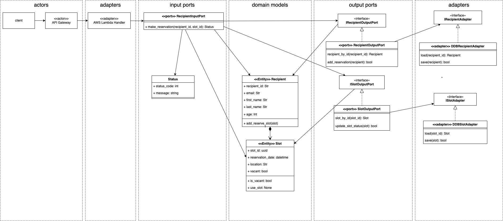

# ヘキサゴナルアーキテクチャを利用した AWS Lambda のドメインモデルオブジェクトサンプル

[-[Readme in English](README.md)-]

## このプロジェクトの目的

このプロジェクトは、ヘキサゴナルアーキテクチャを利用した AWS Lambda 関数のドメインモデルオブジェクトの実装のサンプルです。ヘキサゴナルアーキテクチャ（別名ポートとアダプターアーキテクチャと言います）は、[Dr. Alistair Cockburn](https://en.wikipedia.org/wiki/Alistair_Cockburn)によって提唱されたソフトウェア設計におけるアーキテクチャパターンです。


ヘキサゴナルアーキテクチャ（別名ポートとアダプターアーキテクチャと言います）を利用することで、ドメインモデルと他のレイヤーのコードを分離することができます。このサンプルアプリケーションはシンプルなワクチン予約システムのドメインモデルを実装しています。ポートとアダプタクラスを利用することで、DynamoDB のテーブルをアクセスするようなインフラストラクチャコードとドメインモデルを分離することができます。

このアプリケーションはまた、ポートとアダプタのクラスを注入するために、[制御の反転 inversion of control](https://en.wikipedia.org/wiki/Inversion_of_control)のコンセプトを利用しています。これによってテスト対象のクラスに対してダミークラスを注入することで、ユニットテストをより容易に行うことができるようになっています。詳細についてはプロジェクトに含まれるサンプルのユニットテストをご覧ください。(./tests/unit)

## クラス図



## シーケンス図


## Serverless Application Model

このプロジェクトは Serverless Application Model (SAM）のためのソースとサポートコードを含んいるので、SAM CLI を利用してプロジェクトをデプロイすることができます。以下のファイルとフォルダを参照ください。

- src - アプリケーションの Lambda 関数のコードです。
- events - invoke function で利用可能な起動時のイベント情報です。
- tests/unit - アプリケーションコードに対するユニットテストです。
- template.yaml - アプリケーションで利用する AWS リソースを定義した SAM のテンプレートファイルです。

## サンプルアプリケーションのデプロイ

Serverless Application Model コマンドラインインターフェイス（SAM CLI）は、Lambda 関数のビルド、テスト、デプロイの機能を提供します。SAM CLI は Docker を利用して Lambda の実行に適した Amazon Linux 環境で関数を実行します。またアプリケーションのビルド環境と API もエミュレートします。

SAM CLI を使用するために以下のツールが必要です。

- SAM CLI - [Install the SAM CLI](https://docs.aws.amazon.com/serverless-application-model/latest/developerguide/serverless-sam-cli-install.html)
- [Java 11 (Amazon Corretto) installed](https://docs.aws.amazon.com/ja_jp/corretto/latest/corretto-11-ug/downloads-list.html)
- Docker - [Install Docker community edition](https://hub.docker.com/search/?type=edition&offering=community)

初めてアプリケーションをビルドしてデプロイするには、シェル上で以下のコマンドを実行します。

```bash
sam build --use-container
sam deploy --guided
```

最初のコマンドはアプリケーションのソースをビルドします。２番目のコマンドは一連の問い合わせと共にアプリケーションをパッケージ化して AWS へデプロイします。

Amazon API Gateway のエンドポイント URL は、デプロイ後に表示されるアプトプットの値から取得することができます。

## Lambda 関数を実行する前に DynamoDB のデータを準備

このサンプルアプリケーションを実行するにはデータ準備スクリプトを実行する必要があります。

```bash
$ chmod +x setup/add_ddb_data.sh
$ setup/add_ddb_data.sh

```

## Amazon API Gateway を通じて Lambda 関数を実行する

[Your api endpoint address] を SAM Deploy の output Value に置き換えてください.

```bach
$ curl -X POST -H "Content-Type:application/json" -d "{\"recipient_id\":\"1\", \"slot_id\":\"1\"}" [Your api endpoint address]

{"message": "The recipient's reservation is added."}
```

## ビルドしてローカルでテストするために SAM CLI を使用する

`sam build --use-container` コマンドでアプリケーションをビルドします。

```bash
$ sam build --use-container
```

SAM CLI は、`pom.xml`で定義された依存関係をインストールして、デプロイパッケージを作成し、`.aws-sam/build` フォルダに保存します。

関数単位のテストは、テスト用のイベント情報を伴って関数をローカル環境で直接実行します。イベントは JSON ドキュメントで関数がイベントソースから受け取る入力値を表します。テストイベントは、このプロジェクトの`events` フォルダに含まれています。

関数をローカル環境で実行するには、`sam local invoke` コマンドを実行します。

```bash
$ sam local invoke ReservationFunction --event events/event.json
```

## ユニットテストの実行

テストはこのプロジェクトの`ReservationFunction/src/test` フォルダに定義されてます。mvn コマンドを使ってテストを実行してください。

```bash
$ mvn test
```

## クリーンアップ

作成したサンプルアプリケーションを削除するには、SAM CLI コマンドを利用します。プロジェクトのためのスタック名を stack name とすると、以下のコマンドを実行を実行します。

```bash
sam delete --stack-name [Stack Name]
```

## その他のリソース

SAM の入門、仕様、SAM CLI、Servereless Application のコンセプトについては、[AWS SAM developer guide](https://docs.aws.amazon.com/serverless-application-model/latest/developerguide/what-is-sam.html) をご覧ください。
